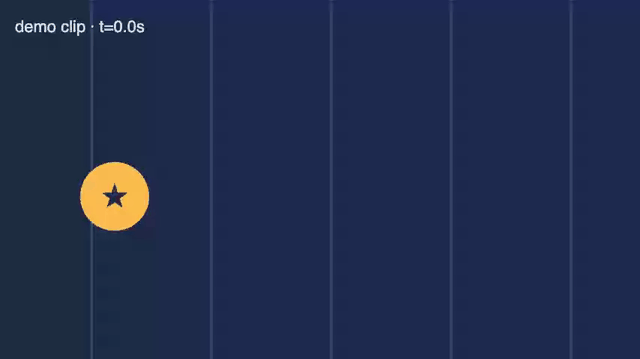

# Zoom Demo Video

Công cụ chỉnh video zoom in/out kiểu Ken Burns (giống CapCut) chạy gọn trong một file HTML — không cần cài đặt, không upload, không cần server.

[🇬🇧 English](README.md)

*Xem trước hiệu ứng zoom (dùng clip test mẫu) — click một điểm, đoạn zoom sẽ mượt mà zoom vào rồi zoom ra.*

## Vì sao có tool này

Đôi khi bạn chỉ cần zoom vào một điểm cụ thể, trong một khoảng thời gian cụ thể, với tốc độ cụ thể — mà không muốn mở hẳn một phần mềm dựng phim. Đây là một file HTML duy nhất làm đúng việc đó. Mở lên là dùng được ngay.

## Tính năng

- **Đoạn zoom (zoom segment)** — đánh dấu điểm bắt đầu và kết thúc trên timeline; ngoài các đoạn đã đặt, video luôn giữ nguyên không zoom.
- **Click để chọn điểm zoom** — click hoặc kéo trực tiếp trên khung hình để chọn vị trí muốn zoom vào; con trỏ hình kính lúp xuất hiện khi đang ở chế độ chọn điểm.
- **Tốc độ zoom vào / zoom ra độc lập** — chỉnh riêng tốc độ zoom vào và tốc độ zoom trở lại, tách biệt với tỷ lệ zoom.
- **Chỉnh sửa khi đang phát** — kéo hai đầu đoạn zoom hay chọn lại điểm zoom không bao giờ làm dừng hay tua lại video.
- **Chuyển động mượt** — zoom được nội suy theo nhịp làm mới màn hình với đường cong easing triệt tiêu cả vận tốc lẫn gia tốc ở hai đầu mỗi đoạn chuyển, nên không bị khựng hay giật ở điểm nối.
- **Canvas responsive** — khung preview tự co giãn theo đúng tỷ lệ khung hình của video, không cố định kích thước.
- **Bấm Record là xong** — tự tua về đầu, tự phát, ghi thẳng từ canvas ở đúng độ phân giải gốc video, tự dừng khi hết video, tự lưu file (MP4 H.264/AAC nếu trình duyệt hỗ trợ, WebM nếu không). Tool còn đo tốc độ ghi thực tế và cảnh báo nếu tab bị chạy nền khiến bản ghi bị khựng.
- **Chuyển ngôn ngữ Anh/Việt** — nút ở góc trên phải, mặc định tiếng Anh.
- **Chạy hoàn toàn cục bộ** — video được đọc qua `URL.createObjectURL`, không bao giờ upload lên đâu cả.

## Cách dùng

1. Mở [`index.html`](index.html) bằng trình duyệt, hoặc dùng **[bản online](https://nixthinh-bit.github.io/zoom-demo-video/)** — không cần tải về.
2. Kéo-thả video vào khung hình, hoặc bấm **Choose video…**.
3. Bấm **+ Add zoom segment at playhead** để tạo một đoạn zoom tại đúng vị trí playhead hiện tại.
4. Kéo hai đầu đoạn trên timeline để chỉnh chính xác thời điểm zoom bắt đầu/kết thúc. Kéo phần giữa để di chuyển cả đoạn.
5. Click vào khung hình để đặt điểm muốn zoom vào.
6. Chỉnh 3 thanh trượt **Zoom ratio**, **Zoom-in speed**, **Zoom-out speed**.
7. Lặp lại bước 3–6 để thêm bao nhiêu đoạn zoom tuỳ ý, ở bất kỳ vị trí nào trên timeline.
8. Bấm **● Record**. App tự tua về đầu, tự phát hết video, và tự lưu file khi phát xong — không cần bấm gì thêm.

Vậy là xong — không cần chỉnh export, không cần chờ render.

## Lưu ý về trình duyệt

- Dùng Chrome hoặc Edge cho kết quả tốt nhất (hỗ trợ đầy đủ ghi MP4 H.264+AAC).
- Giữ tab ở **phía trước** trong lúc quay — trình duyệt sẽ ngưng vẽ canvas khi tab chạy nền, và tool sẽ cảnh báo sau đó nếu tốc độ ghi bị tụt quá thấp.

## Giấy phép

MIT — xem [LICENSE](LICENSE).
